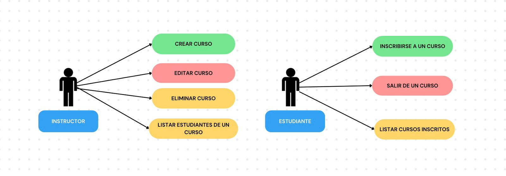
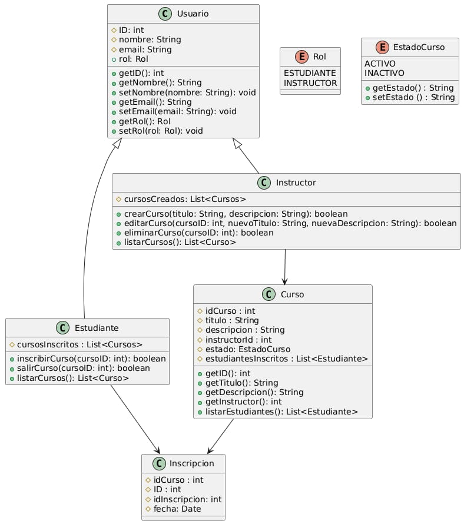

# 📚 API para una Plataforma de Cursos Online

Este proyecto sirve para facilitar la **creación y gestión de cursos por parte de instructores** y permitir a los **estudiantes inscribirse y participar** en ellos.

El sistema busca mantener un registro organizado de todas las inscripciones y proporcionar una funcionalidad clara para la gestión académica de cursos.

---

## 👥 Equipo de Desarrollo

| Nombre del Alumno/a | Carnet | 
| :--- | :--- | 
| Cindy Ariana Reyes Molina | RM24001 | 
| Bryan José Moreno Villanueva | MV24050 | 
| Diego Oswaldo Meza Argueta | MA20081 | 
| Irvin Adonay Ramírez Linares | RL22020 | 

---

## 🎯 Objetivos del Sistema

* Facilitar la creación y gestión de cursos por parte de los instructores.
* Permitir a los estudiantes inscribirse y participar en cursos.
* Mantener un registro organizado de inscripciones y participantes.
* Proporcionar un sistema claro para la gestión académica de cursos.

---

## 📋 Entrega #1

Esta sección documenta los diagramas de diseño y la estructura inicial del proyecto correspondiente a la primera entrega de este mismo el cual se divide en tres entregas.

### 1. Casos de Uso

A continuación se detallan las funcionalidades principales del sistema, agrupadas por Actor:

#### Actor: Instructor (Gestión de Cursos y Estudiantes)

Caso de Uso | Descripción Breve | 
| :--- | :--- | 
| Crear curso | El instructor registra un nuevo curso proporcionando título y descripción. | 
| Editar curso | El instructor actualiza el título o la descripción de un curso ya existente. | 
| Eliminar curso | El instructor elimina un curso de la plataforma, incluyendo todas las inscripciones asociadas. | 
| Listar estudiantes de un curso | El instructor consulta la lista de estudiantes inscritos en un curso específico. | 

#### Actor: Estudiante (Interacción con Cursos)

Caso de Uso | Descripción Breve | 
| :--- | :--- | 
| Inscribirse en un curso | El estudiante se inscribe en un curso que se encuentre en estado activo. | 
| Salir de un curso | El estudiante cancela su inscripción en un curso previamente activo. | 
| Listar cursos de un estudiante | El estudiante consulta todos los cursos en los que se encuentra inscrito. |

#### Diagrama de Casos de Uso

### 2. Modelo de Clases (Modelo Orientado a Objetos)

Este modelo de clases presenta el diseño inicial del programa en java. Utiliza recursos como la **Herencia** y **Composición** para gestionar las relaciones entre las clases y la información que contendrán.

#### Clases y Atributos Principales

* **`Usuario`** (Clase Base)**:** `id`, `nombre`, `email`, `rol` (Enum: `ESTUDIANTE`, `INSTRUCTOR`, `ADMIN`).
* **`Estudiante`** (Hereda de Usuario)**:** `cursosInscritos`.
* **`Instructor`** (Hereda de Usuario)**:** `cursosCreados`.
* **`Curso`:** `idCurso`, `titulo`, `descripcion`, `instructorId` (FK), `estado` (Enum: `ACTIVO`, `INACTIVO`).
* **`Inscripcion`** (Clase de asociación N:N)**:** `idInscripcion`, `idCurso` (FK), `idEstudiante` (FK), `fecha`.

#### Diagrama de Clases

### 3. Modelo Entidad-Relación (Modelo de Base de Datos)

Este es el modelo inicial de la base de datos relacional a utilizar para nuestro proyecto de gestión de cursos. Este diseño se ha llevado hasta la 3NF para asegurar la integridad y eficiencia de los datos.

#### Especificaciones de Tablas

| Tabla | Campo | Tipo | Características | Relación | 
| :--- | :--- | :--- | :--- | :--- | 
| **USUARIO** | `ID_USUARIO` | INT | PK, Auto-increment | | 
| | `NOMBRE` | VARCHAR(100) | Not Null | | 
| | `EMAIL` | VARCHAR(100) | Not Null, Unique | | 
| | `ROL` | ENUM | ESTUDIANTE, INSTRUCTOR, ADMIN | | 
| **CURSO** | `ID_CURSO` | INT | PK, Auto-increment | | 
| | `TITULO` | VARCHAR(200) | Not Null | | 
| | `DESCRIPCION` | VARCHAR(1000) | Not Null | | 
| | `INSTRUCTOR_ID` | INT | Foreign Key | **1:N** con `USUARIO` | 
| | `ESTADO` | ENUM | ACTIVO, INACTIVO | | 
| **INSCRIPCION** | `ID_INSCRIPCION` | INT | PK, Auto-increment | | 
| | `ID_CURSO` | INT | Foreign Key | **N:N** con `CURSO` | 
| | `ID_ESTUDIANTE` | INT | Foreign Key | **N:N** con `USUARIO` | 
| | `FECHA` | DATE | Not Null | | 

#### Diagrama Entidad-Relación

## 📋 Entrega 2

# Cursos Online

Aplicación web para la gestión de cursos, instructores y estudiantes.  
Desarrollada con **Spring Boot** en el back-end y preparada para integrarse con **React** en el front-end.  

---

## 💻 Tecnologías
- **Java 21**  
- **Spring Boot 3.3.0** (Web, Data JPA)  
- **PostgreSQL** como base de datos  
- **Lombok** para simplificar código  
- **Maven** como gestor de dependencias  

---

## 📦 Funcionalidades
- Gestión de **usuarios** (instructores y estudiantes)  
- Gestión de **cursos** (crear, editar, eliminar)  
- Inscripción de estudiantes en cursos  
- Listado de cursos por estudiante e instructores

## 📋 Entrega 3
🚀 Características principales

## CRUD completo para:

Usuarios

Instructores

Estudiantes

Cursos

## Validación de correos electrónicos duplicados.

Manejo de excepciones personalizadas:

ResourceNotFoundException

ConflictException

## Pruebas unitarias con JUnit + Mockito.

## Arquitectura REST clara y mantenible.
- Model
- Controller
- Repository
- Exception
- Service
## Relaciones entre entidades

Usuario → Instructor/Estudiante:
Un usuario puede actuar como instructor o estudiante.

Instructor → Curso:
Un instructor puede crear varios cursos.

Estudiante → Curso (Inscripción):
Un estudiante puede inscribirse en múltiples cursos.

## Tecnologías utilizadas

- Java 17

- Spring Boot

- Spring Data JPA

- Hibernate

- PostgreSQL / MySQL (dependiendo de configuración)

- JUnit 5

- Mockito
